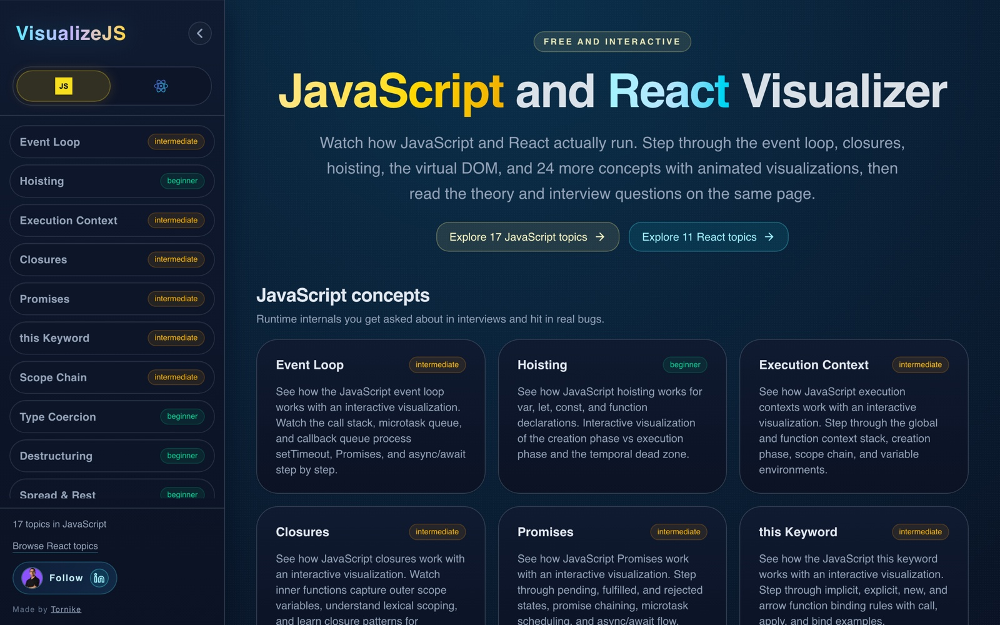

# VisualizeJS

[](https://visualizejs.com) [](https://github.com/tornike14/visualizejs/actions/workflows/ci.yml) [](#topics) [](https://nextjs.org) [](https://react.dev) [](https://www.typescriptlang.org) [](LICENSE)

Interactive visualizations of how JavaScript, React, Vue, Svelte, Angular, backend systems, and AI models work under the hood. Step through animations that show what the engine does at each stage, then read the theory behind it.

45 topics across five categories. Each one pairs a step-by-step visualization with theory sections covering how it works, common mistakes, and interview questions, all on a single page.

[](https://visualizejs.com)

## Getting Started

```bash
npm install
npm run dev
```

Open [http://localhost:3000](http://localhost:3000). The app redirects to `/javascript` by default.

Node 20 or newer is required.

## Scripts

| Command             | Description                                          |
| ------------------- | ---------------------------------------------------- |
| `npm run dev`       | Start dev server (webpack mode)                      |
| `npm run build`     | Production build                                     |
| `npm run start`     | Serve the production build                           |
| `npm run lint`      | Run ESLint                                           |
| `npm run typecheck` | Run TypeScript (also validates every topic registry) |
| `npm run format`    | Format with Prettier (`format:check` in CI)          |
| `npm run verify`    | Lint, typecheck, format check, and build             |

## Topics

Each topic lives at a single route, with the visualization at the top and the theory sections below it. Press `Cmd+K` (or `/`) anywhere to search topics. Space plays and pauses, the arrow keys step, `R` resets, and the scrubber next to the step counter jumps to any step. Topics you finish get a check mark, stored in your browser.

### JavaScript (19)

Runtime internals: the event loop, scope, memory, and async.

| Topic                                                        | Difficulty   |
| ------------------------------------------------------------ | ------------ |
| [Event Loop](/javascript/event-loop)                         | Intermediate |
| [Hoisting](/javascript/hoisting)                             | Beginner     |
| [Execution Context](/javascript/execution-context)           | Intermediate |
| [Closures](/javascript/closures)                             | Intermediate |
| [Promises](/javascript/promises)                             | Intermediate |
| [this Keyword](/javascript/this-keyword)                     | Intermediate |
| [Scope Chain](/javascript/scope-chain)                       | Intermediate |
| [Type Coercion](/javascript/type-coercion)                   | Beginner     |
| [Destructuring](/javascript/destructuring)                   | Beginner     |
| [Spread & Rest](/javascript/spread-rest)                     | Beginner     |
| [Prototypal Inheritance](/javascript/prototypal-inheritance) | Advanced     |
| [Reference vs Value](/javascript/reference-value)            | Beginner     |
| [Heap & Stack](/javascript/heap-stack)                       | Advanced     |
| [Garbage Collection](/javascript/garbage-collection)         | Advanced     |
| [Generators & Iterators](/javascript/generators)             | Advanced     |
| [Event Delegation](/javascript/event-delegation)             | Beginner     |
| [Modules & Imports](/javascript/modules-imports)             | Intermediate |
| [Async/Await](/javascript/async-await)                       | Intermediate |
| [Debounce & Throttle](/javascript/debounce-throttle)         | Beginner     |

### React (13)

How React decides what to render and what it commits to the DOM.

| Topic                                               | Difficulty   |
| --------------------------------------------------- | ------------ |
| [Virtual DOM](/react/virtual-dom)                   | Beginner     |
| [Reconciliation](/react/reconciliation)             | Intermediate |
| [Context Propagation](/react/context-propagation)   | Intermediate |
| [Fiber Tree](/react/fiber-tree)                     | Advanced     |
| [Hooks](/react/hooks)                               | Intermediate |
| [Render Cycle](/react/render-cycle)                 | Advanced     |
| [Memoization](/react/memoization)                   | Intermediate |
| [Suspense](/react/suspense)                         | Intermediate |
| [Server Components](/react/server-components)       | Advanced     |
| [Error Boundaries](/react/error-boundaries)         | Intermediate |
| [useEffect Lifecycle](/react/use-effect-lifecycle)  | Beginner     |
| [State Batching](/react/state-batching)             | Intermediate |
| [Concurrent Rendering](/react/concurrent-rendering) | Advanced     |

### Frameworks (3)

How Vue, Svelte, and Angular track changes, compared side by side.

| Topic                                                            | Difficulty   |
| ---------------------------------------------------------------- | ------------ |
| [Vue Reactivity](/frameworks/vue-reactivity)                     | Intermediate |
| [Svelte Runes](/frameworks/svelte-runes)                         | Intermediate |
| [Angular Change Detection](/frameworks/angular-change-detection) | Advanced     |

### Backend (5)

What happens between a request leaving the browser and the response.

| Topic                                                     | Difficulty   |
| --------------------------------------------------------- | ------------ |
| [HTTP Request Lifecycle](/backend/http-request-lifecycle) | Beginner     |
| [Database Indexing](/backend/database-indexing)           | Intermediate |
| [Caching Strategies](/backend/caching-strategies)         | Intermediate |
| [JWT Authentication](/backend/jwt-authentication)         | Intermediate |
| [Rate Limiting](/backend/rate-limiting)                   | Intermediate |

### AI (5)

What a language model does with your text, from tokens to the next word.

| Topic                                              | Difficulty   |
| -------------------------------------------------- | ------------ |
| [Tokenization](/ai/tokenization)                   | Beginner     |
| [Embeddings](/ai/embeddings)                       | Beginner     |
| [Attention](/ai/attention)                         | Intermediate |
| [Next Token Prediction](/ai/next-token-prediction) | Intermediate |
| [Backpropagation](/ai/backpropagation)             | Advanced     |

Some topics also have a sandbox mode where you can edit the code and watch the visualization respond. Event Loop is the reference implementation.

## Project Structure

```
src/
  app/[category]/           Generated category and topic routes
  components/
    layout/                 Page shell, navigation
    visualization-ui/       Shared primitives (VisualizationToolbar, SourceCodePanel, NeonPanel, ...)
    visualizations/         One folder per topic, plus registry.tsx
  content/theory/           Theory content, one file per topic
  hooks/                    useExampleTopic, useStepPlayback, useChangeFlash
  lib/
    topics.ts               Topic registry, the single source of truth
    metadata.ts             SEO metadata factory
    sandbox/                Sandbox mode infrastructure
```

Adding a topic touches several registries, all typed by `TopicId` so a missing entry fails the type check. [`CONTRIBUTING.md`](CONTRIBUTING.md) lists them.

## Environment Variables

All are optional and have working defaults. Copy [`.env.example`](.env.example) to `.env.local` to override.

| Variable                           | Default                   | Purpose                                  |
| ---------------------------------- | ------------------------- | ---------------------------------------- |
| `NEXT_PUBLIC_SITE_URL`             | `https://visualizejs.com` | Canonical URLs, sitemap, Open Graph tags |
| `NEXT_PUBLIC_CREATOR_LINKEDIN_URL` | Maintainer's profile      | Credit link in the footer                |
| `NEXT_PUBLIC_CREATOR_AVATAR_SRC`   | `/personal-image.png`     | Avatar in the footer                     |

If you fork this, set the last two to your own.

## Contributing

Read [`CONTRIBUTING.md`](CONTRIBUTING.md) first. New topics are welcome, and the authoring docs below walk through the process.

## Documentation

| Doc                                                              | Covers                                       |
| ---------------------------------------------------------------- | -------------------------------------------- |
| [`docs/topic-authoring.md`](docs/topic-authoring.md)             | JavaScript topic creation workflow           |
| [`docs/react-topic-authoring.md`](docs/react-topic-authoring.md) | React topic extensions                       |
| [`docs/component-reference.md`](docs/component-reference.md)     | Design system, components, hooks, animations |
| [`docs/theory-authoring.md`](docs/theory-authoring.md)           | Theory content authoring                     |
| [`docs/sandbox-authoring.md`](docs/sandbox-authoring.md)         | Sandbox mode                                 |
| [`docs/architecture.md`](docs/architecture.md)                   | Frontend architecture rules                  |
| [`docs/categories.md`](docs/categories.md)                       | Category registry and adding a category      |
| [`docs/seo.md`](docs/seo.md)                                     | SEO implementation                           |

## Tech Stack

- [Next.js 16](https://nextjs.org) App Router
- React 19
- TypeScript (strict)
- Tailwind CSS v4
- [shadcn/ui](https://ui.shadcn.com) primitives
- CodeMirror 6 and Acorn for sandbox mode

## License

[MIT](LICENSE)
